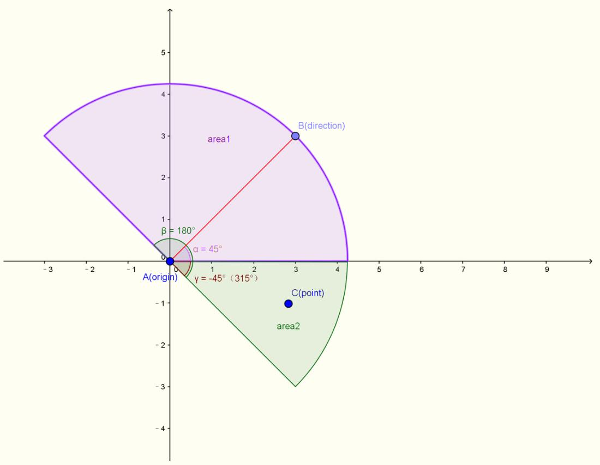

[TOC]

# 队式20

<!--游戏名未定，暂用队式20称呼游戏，后面定名字了直接全部替换即可，另外后面有未明确指出的待定内容都用这样的注释法写-->

## 一、总述

整个地图基于模仿吃鸡的模式，故事背景暂定，一些细节名字有待修正，本文档暂时(2018/8/3)只作概念、宏观上的规定。所有参赛队伍的AI将控制相应角色同时被随机投放到地图各处，在地图上寻找装备、补给等，经过战斗直到只剩下一支队伍的角色存活时游戏结束。本文中将以玩家指代参赛选手，以AI指代参赛选手所写程序，以角色指代AI所控制的在游戏中进行战斗的对象。

本游戏采用细分像素的表示法，一个角色将是由多个像素表示成的近圆形，每个东西都应当由多个像素组成，地图大小为$m*n$（待定），但是整个地图不必作为数据进行传输，可以单处理局部地图数据。游戏将以帧作为回合界限（即调用玩家AI的频率），并以<!--每秒20帧（20fps）-->的速度进行。

## 二、规则

### (1)指令

玩家的指令接口包括**移动**、**调整**、**攻击**、**整理**、**待命**、**拾取**、**无线电**。指令有**优先级**与**CD**，一个指令可能需要不止一帧的时间来完成，这个完成所用帧数即是CD值，<u>CD期间只有更高级的指令可以打断它</u>，优先级则是一个用来比较指令优先度的非负整数，<u>数值越大的指令优先级越高</u>，AI需要分析局面，合理发送指令来博取优势、取得胜利。发送一次指令时，需要指明指令名、给定该指令的相关参数，以指令名为索引，无用参数将被无视，无效指令也将被无视，具体指令解释如下：

#### a.移动

- [ ] ##### 简介

角色的移动方向将由角度指令决定，**移动速度**指一次移动指令后若不被打断角色移动的距离，**移动速度上限**与当前**负重**与**状态**有关，具体公式为<!--待填坑-->，AI可以在允许范围内自行决定本次移动的速度。

- [ ] #####指令参数

1. 移动角度：一个`float`量，应当不小于**-180**且不超过**180**，计算方法是相对视线逆时针的角度
2. 移动速度：一个`int`量，应当不超过**移动速度上限**且不低于**移动速度下限**<!--（100）-->，当取值范围为空集时即不可移动

#### b.调整

- [x] ##### 简介

调整指调整角色当前的**视线**与**状态**，后者分为**站立**、**蹲下**、**趴下**三种。站立为常规姿势，蹲下时根据地形角色被命中的机率将下降，但同时移动速度也会下降，趴下时根据地形角色被命中或发现的几率将下降，但同时无法移动。视线调整指改变角色面向的方向，包含一个角度参数，计算方法与移动一样，使用缺省参数可以不改变视线/状态。

- [x] ##### 指令参数
1. 状态：一个`int`（宏）量（`STATE_STAND/STATE_SQUAT/STATE_DOWN`），指代新的状态
2. 视线：一个`float`量，应当不小于**-180**且不超过**180**，计算方法是相对视线逆时针的角度

#### c.攻击

- [x] ##### 简介

发送攻击指令后将使用**在持武器**朝指定方位进行攻击，攻击方式由武器决定。普通的武器只能指定攻击角度，特殊武器附带有一些独特参数，指定无法使用的参数将被无视（比如说使用手枪时指定攻击距离）。

- [x] ##### 指令参数

1. 攻击角度：一个`float`量，取值范围为视角范围（即攻击视角之外区域必须先使用调整指令转身），计算方法是相对视角逆时针的角度
2. 攻击距离：一个`unsigned int`量，对于可以指定攻击距离的武器进行攻击距离指定，应当不超过武器的**攻击距离**，超过则自动截取为最大距离（但依然是有效指令）
3. 攻击方式：一个`int`（宏）量，只对部分特殊武器生效，将在武器部分一一罗列。

#### d.整理

- [x] ##### 简介

该指令将用于整理角色**装备**、**装备配件**、**道具**等，包括将一个装备配件转移到另一个装备上，将物品**丢弃**或**摧毁**，切换主武器，这些操作都由整理指令发出，指令将声明目标物品的ID，（可能用到的）另一个物品ID，行为。

- [ ] ##### 指令参数

1. 物品1ID：一个`unsigned int`量，指明操作对象的物品ID
2. 物品2ID：一个`unsigned int`量，指明另一个操作对象（如果需要的话）的物品ID，缺省值为<!--待定-->
3. 行为：一个`int`（宏）量，分别为`TIDY_CHANGE`（改变配件位置）、`TIDY_EXCHANGE`（切换主武器）、`TIDY_DISCARD`（丢弃物品）、`TIDY_DISTROY`（摧毁物品）<!--待补充-->

#### e.待命

- [x] ##### 简介

待命是一个打断性指令，将试图中止一切可能中止的指令，恢复到站立状态，如果不指定角度将面朝原来的角度，或者制定角度以将视线改为目标方向。

- [x] ##### 指令参数

3. 方向：一个`float`量，应当不小于**-180**且不超过**180**，计算方法是相对视线逆时针的角度，缺省值为0

#### f.拾取

- [x] ##### 简介

当角色**感知**内有可拾取的物品时，可以通过发送拾取指令来捡起目标物品，需要指定物品ID，并且由于不同物品可能支持拾取后以不同方式存储，因此还应指定**拾取方式**，拾取本身无CD，但是某些特定拾取方式可能会产生CD，这将在具体物品介绍部分列出。不合法的拾取指令将被无视，同一回合内不同角色拾取同一物品将随即决定一个人拾取成功。

- [x] ##### 指令参数

1. 物品ID：一个`unsigned int`量，指明操作对象的物品ID
2. 方式：一个`int`（宏）量，表明拾取时对物品做的一些操作，具体宏将在相应物品部分列出。

####g.无线电

- [ ] ##### 简介

无线电指令是本游戏团队合作的精髓，无线电消息为一个32位整数，AI将通过无线电给队友发送信息，并通过接收队友传来的信息进行决策与团队合作，内容所指定的含义由玩家队伍自行商议决策，本指令应指明接受消息的队友ID，消息，接受者将会通过**听觉**得到**消息**、**发送者**的ID以及**时延**。应注意发送无线电的过程是瞬间完成的，但是无线电将以<!--3000/帧-->的速度传播，因此到达接收者处将需要经历一定帧数，这个帧数称作时延，玩家将需要用时延估算距离。一般情况下一个AI一帧内最多发送一条无线电。

<!--注释：由于消息机制内部讨论时多次修改，可能有些地方没能更新到最新版，如果发现此部分文档逻辑矛盾或不清晰处请联系本人--饶淙元2018/8/4 14:59-->

- [ ] ##### 指令参数

1. 目标ID：一个`unsigned int`量，表示目标的ID。另外通信兵有额外参数，在通信兵处给出。
2. 消息：一个`unsigned char/int`量，作为发送的消息传出，消息所表示的意义需要玩家自行商议。注：此处提供两种消息发送模式，一种是纯粹由玩家自定义的32位整数消息，接收者将直接对这个32位整数进行处理，一种是封装好的简洁接口（萌新友好型），简洁接口中将自动将坐标信息发送者HP等信息打包发送过去，玩家自定义信息只是一个`unsigned char`（即至多256种消息），解包时也只需要调用相关接口即可自动获取相应消息。关于两种接口的具体内容在 [三、选手接口](#三、选手接口) 中给出。

#### 附表:指令CD与优先级

|  指令  |  CD  | 优先级 |
| :----: | :--: | :----: |
|  移动  |      |        |
|  调整  |      |        |
|  攻击  |      |        |
|  整理  |      |        |
|  待命  |  0   |        |
|  拾取  |  0   |        |
| 无线电 |  0   |        |

### (2)感知

#### a.视觉

视觉是获取游戏信息的主要途径，每名角色始终有三个关于重要视觉的重要变量:**视线**、**视角**和**视距**。角色的视野为一个扇形区域，视线即扇形的中心线，扇形区域将沿中心线顺逆时针各转视角的半角，我们将视觉可以获取信息的地方称作**视野范围**，具体来说可以参考下图（俯视图）:

图中的direction所给定的红线就是视线，β=180°就是视角（仅举例，实际参数未必是这么多），红色线段的长度，也即扇形半径，既是视距，而图中的粉色区域与绿色区域的并集就是视野范围。需要注意的是游戏给出的信息仅仅是视野范围内可获取的信息，但是可能会遇到障碍物，比如上图中我们假设x正半轴上有一堵高墙，那么绿色范围的信息AI不可获取，此时AI只能获取到x正半轴上有一堵墙，<u>如果试图获取绿色区域信息得到的反馈将<!--是空地而不是盲区--></u>！

在实际游戏中通常只有视线是AI可以自行决定的，视角和视距都由角色的**英雄**、**物品**、所处**地形**等决定，AI只能获取这些参数而不能改变。

#### b.听觉

视觉作为主要信息获取途径，通常是AI主动获取，而听觉则是一个被动获取信息的过程。游戏中的听觉信息主要分为两大类：**环境声音**与**无线电**。获取到的听觉信息会放到一个队列里，如果没有及时获取，则会在下一帧里自动清空。环境声音将有显著的特征来便于玩家区分，AI理应每回合将听觉信息遍历一遍并做出判断。所有的声音信息均包括**消息**、**发送者**和**时延**，其中消息是一个`int`型变量承载消息所含的信息，发送者是一个`unsigned int`作为信源ID，时延是一个<!--times-->型变量告诉接收者这则消息距离发送过去了多少帧。听觉相关特征如下：

1. 环境声音：信源ID<!--为-1（即0xffffffff或4294967295）-->，消息中<!--此处规定编码方式以决定声源角度与声音类型-->。
2. 无线电：信源ID为队友ID，消息的含义自定义（两种接口），玩家需要内部商议。

附表：不同声音的发出时机与宏

| 声音类型    | 发出时机                     | 传播距离<!--待定--> | 宏<!--待定--> |
| ----------- | :--------------------------- | ------------------- | ------------- |
| 脚步声      | 移动速度大于<!--150-->时发出 |                     |               |
| 出膛声      | 普通枪子弹出膛时发出         |                     |               |
| 狙击声      | 狙击枪子弹出膛时             |                     |               |
| 机器声      | 电子设备时工作时发出         |                     |               |
| 水声        | 水流持续发出                 |                     |               |
| 中弹声      | 角色中弹时发出               |                     |               |
| 锤声        | 角色挥动虎涛锤时发出         |                     |               |
| 爆炸声      | 手雷、普通炮弹炸裂时         |                     |               |
| 闪光弹声    | 闪光弹炸裂时发出             |                     |               |
| 烟雾弹声    | 烟雾弹炸裂时发出             |                     |               |
| 电磁声      | 电磁炮弹炸裂时发出           |                     |               |
|             |                              |                     |               |
|             |                              |                     |               |
| <!--待续--> |                              |                     |               |

### (3)物品

物品是对游戏中各类可获取、可使用物的一个统称，细分可分为**装备**、**道具**、**配件**。其中，不同的物品属性决定了一个物品的基本特征，而同类物品又有各自独特的属性，这里将详细列出。

#### a.整体特征

- 装备：角色可以穿戴的物品，装备均有一个值（**耐久度**）来衡量其使用程度，当耐久度为0时装备将损坏，表现方式为该装备永久消失，一般情况下装备无法修补。装备又可以分为防具和武器，具体说来防具的耐久度即为防具的磨损度，武器的耐久度则是指子弹数（特别的，近战武器也有类似的概念），且防具穿戴后将直接生效，遭受攻击时视情况损失耐久度，武器穿戴后即表现为**在持武器**。
- 道具：一次性使用的物品，该部分物品通常为小件道具，应对特殊情况。
- 配件：属于辅助性物品，主要用于强化一些装备，该类型物品不可摧毁，无耐久度，可指定安装配件的装备，配件只有被安装后才能生效。

#### b.枚举

<!--这口大锅暑假结束都不一定能写完，这里先给一个模板，希望逻辑组的朋友没事儿了帮忙写写（虽然我也知道可能说这句话只是个心理安慰orz）-->

##### 1.虎涛锤

简介：游戏里唯一的近战武器，杀伤力极强，阴人神器，但是强大的力量不是凡人可以驾驭，普通人使用它时攻击速度极慢。

类型：装备-武器

耐久度：<!--100-->

攻击距离：<!--100（这个显然与我们规定的角色半径有关）-->

攻击CD：20帧

伤害系数：<!--80-->

重量：<!--100-->

特性：挥动时移动速度下降50%

### (4)地形

#### a.平地

#### b.树木

#### c.矮墙

#### d.草丛

#### e.浅滩

#### f.深水

#### g.峭壁

#### h.斜坡

#### i.待补

#### j.待补

#### k.待补

### (5)角色信息

角色信息指的AI可以获取的关于自己所操控角色的全部信息，包括：**HP**、**移动速度上限**、**移动速度**、**状态**、**负重**、**视线**、**视距**、**视角**、**坐标**、**在持武器**、**防具**、**背包**。以下给出这些信息的概念，可见/不可见指其他人能否通过视觉感知到这些信息，需要注意的是可见性对敌人和队友没有差异，需要向队友透露特别信息可用无线电来完成。

- HP：Heal Point，血量，该值一个0到100之间的整数，受到伤害后会降低，降至0时角色死亡。除0外不可见。
- 移动速度上限/移动速度/状态：见 *(1)指令* 。移动速度上限不可见，移动速度与状态可见
- 负重：指角色携带所有物品重量之和（不包括行动在外的电子设备）。不可见
- 视线/视距/视角：见[感知](#(2)感知) 。视线可见，视距与视角不可见。
- 坐标：即角色中心所处的坐标，这里需要指出的是角色在假想的二维地图上所占据的点并不止一个，但是形状为圆形，此处给出的是圆心坐标。可见。
- 在持武器/防具：见[物品](#(3)物品) 。可见。
- 背包：存放玩家所有未穿戴物品的集合，没有上限，但是当负重过大时会出现无法移动的窘况。角色生前不可见，死亡后近距离<!--（100以内）-->可见。

### (*6*)职业

每一个AI在游戏开始前都应该选择一个职业决定自己角色的特殊属性，职业一旦选择不可更改，且同一支队伍AI不得选择重复的职业，玩家应当合理选择职业以组成强大的队伍。所有职业描述与特性如下：

#### a.医疗兵

简介：人在江湖走，哪能不挨刀？挨刀不要紧，我有医疗兵！医疗兵理应是团队不可缺少的一部分，能够携带药品，救治队友，甚至让HP降为0的队友获得新生。

特性：可以将药品作为道具携带；可以对队友使用药品（效果降至80%）；可以对HP为0的队友使用药品以复活角色（效果降至50%，且每个角色最多被复活一次）。

定位：奶妈

语录：“我还能再救一个！”

#### b.工程师

简介：都9012年了，无人机都不会玩？哼，且看我控制那边的侦察机和作战车剿灭前面那支队伍。工程师是昔日~~电设拿过冠军的存在，~~接受过良好的硬件训练，精通各种电子设备的使用，只有工程师才能修复并操控地图上的大型电子设备等。

特性：可以修复并控制随机投放的侦察机、作战车、炮台。

定位：辅助/坦克（操控对象）

语录：“你的操作方式是对这些美丽的金属生命的残忍践踏！”

#### c.通信兵

简介：说好的团队作战，怎么又玩成个人英雄主义了？苟利队伍生死以，无论祸福我指挥！通信兵能够使用<!--求补一个合适频率，我不知道该写啥-->波段的高频信号进行通信，避开干扰，从而更高效地传播信号，增强队友发送无线电的能力。

特性：队伍里有通信兵时发送无线电的传播速度将翻倍，团队的每个AI都可以群发无线电，且通信兵一回合至多发送两次无线电。

定位：统领

语录：“嘀……嘀嘀嘀……嘀……嘀嘀嘀嘀……”

#### d.黑客

简介：那一天，我选择了该死的红色药丸，从此漫步在命运与虚实的谎言中……黑客拥有极高的软件能力，精通C++以外所有编程语言，能够使用四维传送门，解锁密码箱以获取高级装备。

特性：可以打开/关闭地图中的思维传送门；可以破解随机投放的密码箱并暴露出其中的装备。

定位：辅助

语录：“我深刻地怀疑我们所处的世界是二维的，到底是谁蒙蔽了我们的双眼？”

#### e.机械师

简介：机甲受损了？不用怕，随手修，闭眼打。铁匠拥有熟练的金属修复技艺，能够借助废铜烂铁来修复各种金属设备。

特性：能够将盔甲、侦察机、作战车、炮台、虎涛锤之间的耐久度进行相互修复。（注：一次修复后被用来修复的物品将被自动摧毁，耐久度以50%的比例转移到待修复物品上，如果耐久度超过上限则自动被截断为上限）

定位：辅助

语录：“别急，这个轮子马上就造好了。”

#### f.背锅侠

简介：这个锅没人背？当仁不让！背锅侠背锅经验极佳，力气远超常人，能够背下更多的东西，已经不在凡人范畴，甚至可以正常挥动虎涛锤。

特性：[负重因子](#Weight) 降至<!--0.5（这是 接口-移动 中移动速度上限公式的参数）-->，且挥动虎涛锤时移动速度不会减慢。

定位：输出/辅助（取决于携带物品）

语录：“谁也不许动我的锅!”

#### g.狙击手

简介：屏息，凝神，静候——一击必杀！狙击手精通狙击之道，善于用狙击枪进行弱点攻击，能够最大程度地发挥出狙击的作用。

特性：使用狙击枪时伤害翻倍。

定位：输出

语录：“形神合一，攻敌一处。”

### (7)计算机制

#### 1.子弹轨迹

子弹出膛后将携带六个信息：**子弹半径**，**射程**，**射速**，**中心坐标**，**角度**，**伤害系数**，**来源**。

- 子弹半径：子弹的模型半径，子弹并非是单像素，尤其是炮弹等，因此有子弹半径。
- 射程：这里的射程指子弹余下的最大射程，当射程为0时子弹即到达最大距离，自动消失。
- 射速：指子弹每帧前进的距离，每帧刷新后射程减去射速得到新的射程，射速会因[地形](#(4)地形)衰减，但不会因距离衰减。
- 中心坐标：确定子弹位置的中心坐标。
- 角度：指子弹飞行角度，每回合子弹都按此角度进行飞行。
- 伤害系数：决定子弹击中目标时造成的伤害，伤害系数会因[地形](#(4)地形)衰减，但不会因距离衰减。
- 来源：记录射出子弹的角色ID

#### 2.伤害公式

### (8)逻辑顺序

### (9)

### (10)排名与积分

正式比赛前玩家可自行组合AI进行练习，此部分练习不计入最终评分，正式比赛期间所有队伍将同时加入一场比赛，单场比赛排名指以每支队伍最后一个角色死亡作为队伍被淘汰的标志，根据被淘汰的先后顺序决定排名，但积分除了看排名之外还需要看其他情况，具体如下表所示：

|            成就             | 积分<!--待补充--> |
| :-------------------------: | :---------------: |
|        *排名为第n名         |                   |
| 杀敌（击杀/双杀/三杀/四杀） |                   |
|     距离大于3000的击杀      |                   |
|        近战武器击杀         |                   |
|          道具击杀           |                   |
|        *全场最多击杀        |                   |
|                             |                   |

说明：

- 除“杀敌”以外的成就项目各玩家独立统计，每位玩家每场比赛某一成就最多获得一次
- “杀敌”成就允许单场比赛中累次获取，游戏将以一个各AI独立拥有的计数器来判断玩家到底获得了哪一个成就，该计数器持续时间为50帧，每当玩家杀敌后刷新计数器数值与时间，且计数器满4后自动清零。如一个玩家连续5帧内一帧完成一次击杀，那么他将依次获得：击杀、双杀、三杀、四杀、击杀成就，并且此时拥有一个数值为1、持续时间剩余50帧的计数器。
- 带*成就为团队成就，每场比赛结束后将会以队伍为单位进行评比。
- 一场比赛结束后，每支队伍所有角色获得的积分之和外加团队积分即为一场比赛所得总分。

## 三、选手接口